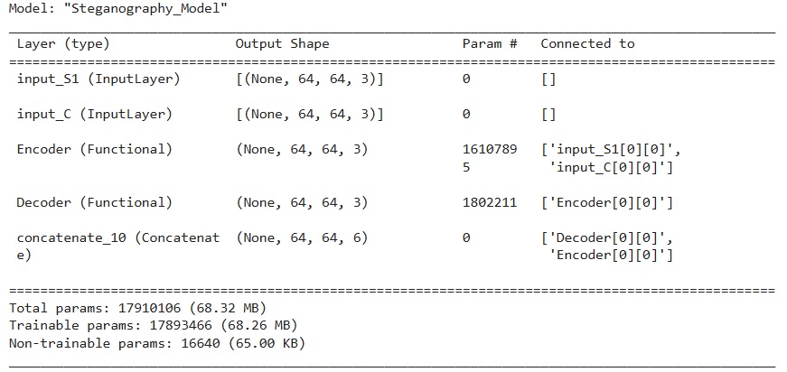
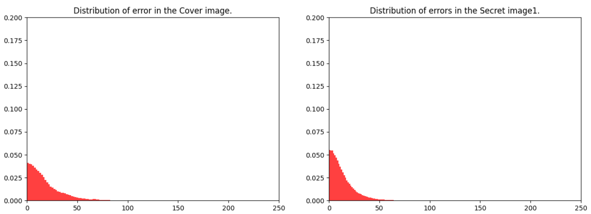
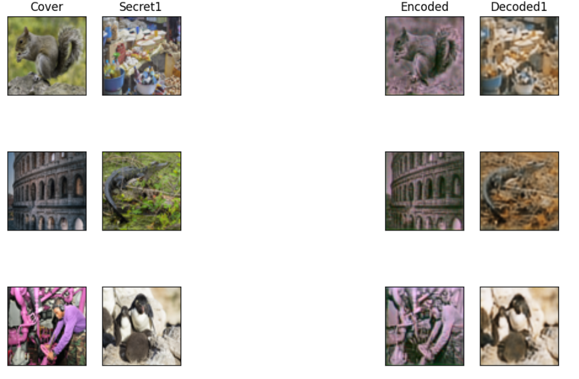
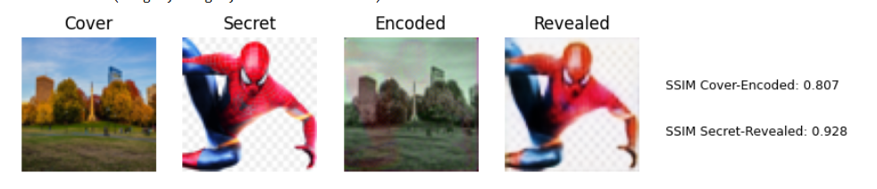

# Image-Steganography - Convolutional Autoencoders
A deep learning-based steganography project utilizing autoencoders to securely embed and extract hidden messages within images.

## 1. Detailed Description
 This project deals with the practical application of a steganography system that will quiet use Deep Learning techniques, in particular, Convolutional Auto-encoders. The main aim of this project will be to securely hide a secret image inside another cover image from which it could then retrieve it back. The project will be designed so that it not only retains the cover image but also hides the secret image inside it effectively.

### Key Components:

1. **Dataset Preparation:**
   - High-resolution images from the DIV2K dataset are used in the training and validation processes.
   - The high-resolution images were pre-processed and resized to a fixed shape of `(64 x 64)`.
   - As a result of the split, half of the train images are secret images, while the other half are cover images.
  

     

     

2. **Model Architecture:**
    - **Encoder:**
      - The encoder, which makes up the first half of the autoencoder, embeds the secret image into the cover image. The images are processed through it with convolutional layers with different kernel sizes and activation functions. Upscaling in the network is done with subpixel convolution, while feature maps at different levels are concatenated for merging information from different layers.
    
    - **Decoder:**
      - The second half of an autoencoder is the decoder; it retrieves the hidden secret image from the encoded image. For this, it again utilizes convolutional layers to decode the embedded information and reconstruct the secret image.
    
    - **Autoencoder:**
      - In this ensemble model, the embedding and revealing parts are combined so that both embedding and revealing procedures can be learned together. It is trained with an expanded loss function that includes not only the Mean Squared Error but also the Structural Similarity Index, Peak Signal-to-Noise Ratio, and a color histogram loss to maintain high fidelity in the reconstruction of images in both embedded and recovered states.
     

        

        

3. **Training and Evaluation:**
    - The model is trained for multiple epochs with a batch size of 16. A decaying learning rate schedule gives better convergence. The process is monitored with validation data, and the evaluation of the encoder and the decoder is to be tracked for the performance. Save loss history for both train and validation phases.
    - It contains visualization tools for model progress throughout the stages of training. This displays the cover, secret, encoded and decoded images for every epoch.

4. **Loss Functions:**
    - **Combined Loss:** The end-to-end loss function contains the combined MSE, SSIM, histogram loss as well as the PSNR loss so that the encoded image is very close in appearance to the cover image and the decoded image very close in appearance to the original secret image.
    - **Full Loss:** The loss function is applied to both the secret and cover images for their effective optimization during the training process.
   
5. **Image Processing Techniques:**
    - The project makes use of other techniques for image processing, which includes sharpening and smoothing, to give the encoded and decoded images a better look of quality.

7. **Evaluation Metrics:**
   - The Structural Similarity Index is a parametric method to determine the similarity of the original and decoded images. This process ensures the correctness of the retrieval of hidden information.

8. **Visualization:**
   - There are extreme visualization possibilities in which cover, secret, encoded, and decoded images are arranged parallel to each other, which leads too 
understood and visualized steganography process.
   - Visualizations of pixel errors show distribution between the original and decoded images.

9. **Applications:**
   - Secure communication: it means here that the information to secure and protect has to be hidden anonymously in some benign carrier and to allow the recipient to retrieve the original information from the carriers.
   - The use of the Convolutional Autoencoders shown in the project is a modern way of steganography to achieve very high accuracy, both in the case of hiding and revealing the hidden information.

## 2. Installation

#### Clone the repository
git clone https://github.com/username/steganography-using-autoencoders.git

#### Navigate to the project directory
cd steganography-using-autoencoders

#### Create a virtual environment (optional but recommended)
python -m venv venv
source venv/bin/activate  # On Windows: venv\Scripts\activate

#### Install the required dependencies
pip install -r requirements.txt

## 3. Dataset
  - The project uses the DIV2K dataset, which contains high-resolution images used for training and validation.
  - The dataset can be downloaded from Kaggle using the following command: !kaggle datasets download -d joe1995/div2k-dataset
  - Or download from this link: https://www.kaggle.com/datasets/joe1995/div2k-dataset
  - The images are preprocessed to a fixed size of 64x64 pixels for model input.
  - For training, half of the dataset is used as cover images and the other half as secret images.

## 4. Results

  - **Distribution of Error in Cover & Secret Image**
    

   
   

  
  - **Encoded and Decoded Output**
    

    
    

    
  - **Structural Similarity Index Score (SSIM)**

    
    

    

## 5. References
  - SteganoGAN : https://github.com/DAI-Lab/SteganoGAN
  - End-to-End Image Steganography Using Deep Convolutional Autoencoders : https://ieeexplore.ieee.org/document/9541180
  - End-to-end Trained CNN Encode-Decoder Networks for Image Steganography : https://paperswithcode.com/paper/end-to-end-trained-cnn-encode-decoder

## 6. Contact
  - For questions or collaborations, you can reach me at samama4200@gmail.com.
  - Connect with me on LinkedIn. www.linkedin.com/in/samama-
